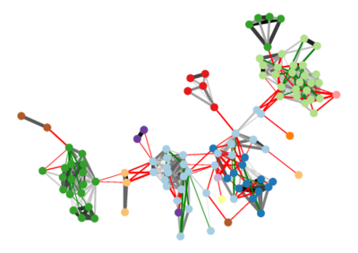
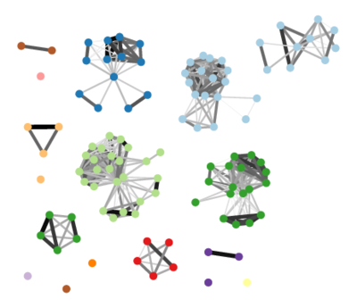

# Weighted F-free Edge Editing




> *Example of a protein-protein interaction network which is edited to be (C4, P4)-free. The connected components can be
> used for clustering.*

This is the source code for a bachelor thesis regarding the Weighted F-free Edge Editing Problem. We implement a FPT and
an ILP algorithm to solve the problem exactly. The FPT algorithm and ideas are based on [GHS+19] for
(unweighted) F-free Edge Editing. The license for their work can be found under [`extern/fpt-editing/LICENSE`](extern/fpt-editing/LICENSE).

A detailed introduction to the problem and a description of the algorithms are given in the thesis.

```
[GHS+19] Lars Gottesbüren, Michael Hamann, Philipp Schoch, Ben Strasser, Dorothea Wagner, and Sven Zühlsdorf.
Engineering Exact F-free  Edge Editing. Unpublished, 2019.
```


## How to build

```bash
mkdir build && cd build
cmake .. -DCMAKE_BUILD_TYPE=Release
make
```

## Datasets

Information about the datasets can be found in the `data` directory. Datasets can be downloaded, generated and filtered
through Python scripts found in the `scripts` directory.


## Dependencies

* [Boost](https://www.boost.org/)

* [Gurobi](https://www.gurobi.com/) *(optional)*

  Used for an [ILP algorithm](src/solvers/ILPSolver.h) as an own solver and for
  [Linear Program Relaxation](src/lower_bound/LPRelaxationLowerBound.h) to compute lower bounds for the
  [FPT algorithm](src/Editor.h).

  You can get Gurobi [here](https://www.gurobi.com/de/downloads/).

* [YAML CPP](https://github.com/jbeder/yaml-cpp/)

  ```bash
  sudo apt install libyaml-cpp-dev
  ```

* [ILS MWIS](https://sites.google.com/site/nogueirabruno/software)

  Used to explicitly solve an MWIS instance to compute a subgraph packing for lower bounds for the FPT algorithm.

  ```bash
  extern/ils_mwis/get.sh
  ```

## FPT algorithm

The fixed-parameter tractable (FPT) algorithm branches on the possible choices and recursively calls itself to explore a
search tree. It uses 

```
Title:	FPT Algorithm for Weighted F-free Edge Editing
Input:
	A graph G = (V, E),
	a set of forbidden subgraphs F,
	a cost function c: (V choose 2) -> R_{>= 0},
	a maximum editing cost k in R,
	the set of marked vertex pairs M subset of (V choose 2) and
	the set of currently edited vertex pairs L.
	
	F and c are fixed throughout the algorithm.
Output:
	Solutions to the F-free Editing Problem} with total editing costs of at most k.

if k < LowerBound(G, k, M):
	return

S := FindForbiddenSubgraph(G, M)
if S is none:
	output L
	return

m := {}						// locally marked vertex pairs
for all e in (S choose 2):
	if e not in M:
		M += {e}; m += {e}; L += {e}
		G.toggle(e)
		Edit(G, k - c(e), M, L) 	// recursive call
		G.toggle(e)
		L -= {e}

M -= m						// unmark vertex pairs

```

## How to cite

```
Jonas Spinner.
Weighted F-free Edge Editing. Bachelor's thesis, Karlsruhe, 2019.
```


```bibtex
@thesis{Spinner2019,
	title = {{Weighted} {F}-free {Edge} {Editing}},
	language = {en},
	school = {Karlsruhe Institute of Technology},
	author = {Spinner, Jonas},
	year = {2019},
	type={Bachelor's thesis}
}
```

## License

This project is licensed under the [MIT license](LICENSE). The licenses of external sources can be found in their
respective directories.
